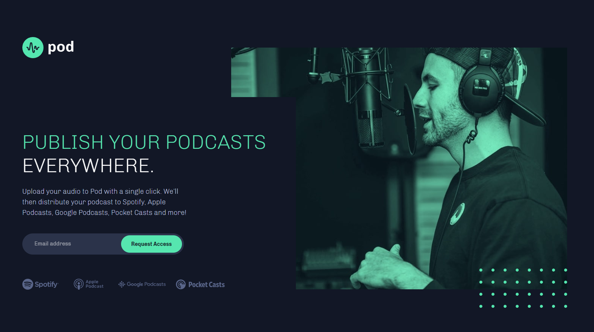
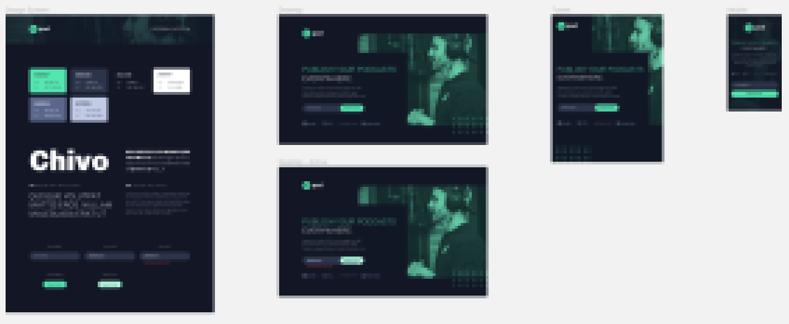

# Pod Landing Page

Made with React! This is a Request Access Landing Page using a professional design from Frontend Mentor. The design is provided in Figma and is recreated to be pixel-perfect.

**Link to project:** https://zealous-swanson-1dc158.netlify.app/

## Figma Design by Frontend Mentor:

## How It's Made:

**Tech used:** React, Styled-Components, JavaScript, Flexbox / Grid

I used React for this entire site, and though it may seem overkill, I intended it to be one component that I could add to any future site of my choosing. Again using styled components as I am currently enjoying working with it. I have a Global Styles file that contains colors or font sizing that made multiple appearances in my code to make this component flexible. If I want to adopt this component to a new site, I now have to make minimal code edits to change the look of everything.

The form is custom and created with CSS Grid. All of that code can be found in AccessFormStyles.js and took a lot of tweaking to get it working with both desktop and mobile views.

The landing page is fully responsive while remaining true to the original Figma design.

## Optimizations

I am happy with how the site came out, though I would use more vertical space if I were to improve the design. If visiting the site from a tablet, much of the content is crammed toward the top. I am capable of creating this though the point is to **recreate** the design.

Some other improvements would be animations, which would bring the landing page to life. Perhaps even a mouse move parallax tied to the dot pattern. Here is an example on CodePen of what I am talking about
**credit to oscicen** https://codepen.io/oscicen/pen/zyJeJw

## Lessons Learned:

This exercise allowed me to practice moving images around using CSS while not just breaking everything around it. During each major media query, I went back and took great care to make sure the image looked good and performed well. What probably seemed to take the longest was creating the custom email input form. I intended for the code to stay readable and scale if I wanted to use the form in a different project.

## Examples:
Take a look at these couple examples that I have in my own portfolio:

<!-- MODIFY THESE -->
**Pizza Site:** https://github.com/ohmymario/pizza-site

**Coffee Roasters:** https://github.com/ohmymario/coffee-roasters

**Color Palette:** https://github.com/ohmymario/Color-Palette